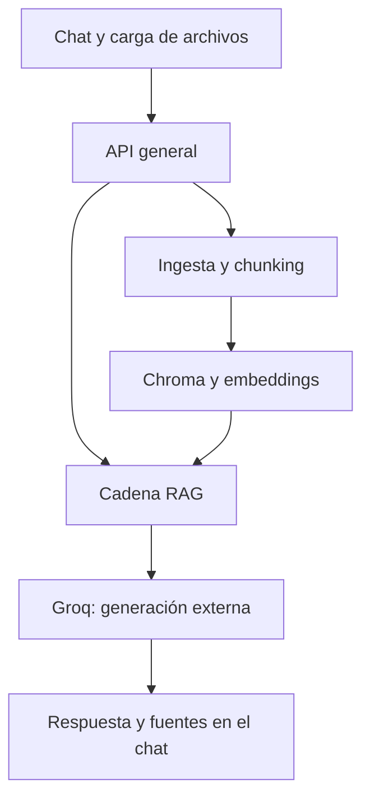
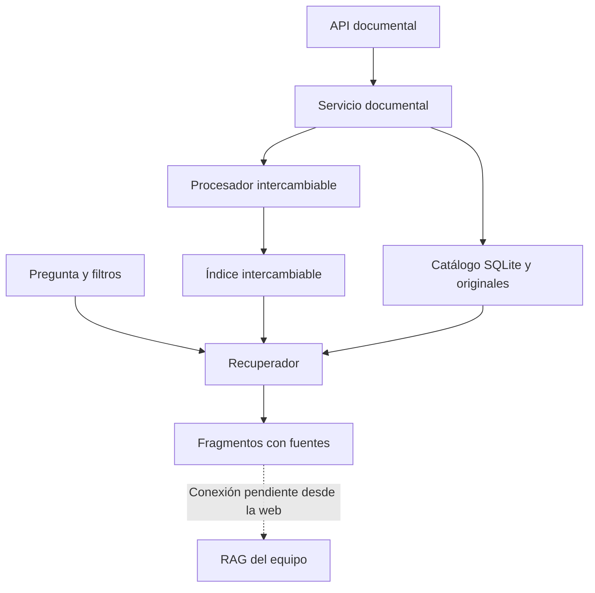
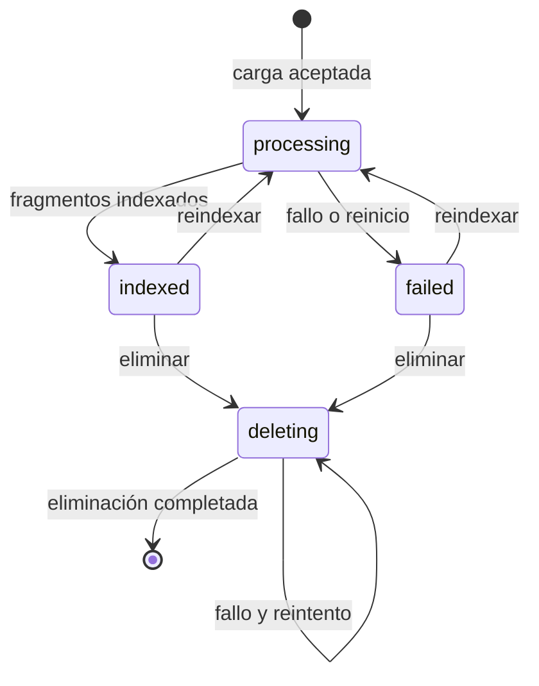

# PRL-IA

Asistente documental de prevención de riesgos laborales para consultar información con fuentes verificables. Proyecto de equipo del bootcamp de IA/ML, Módulo V.

**Estado revisado el 06/10/2026 sobre `dev`, commit `2030174`:** la aplicación web integra carga PDF/TXT, ingesta y chunking, Chroma y respuestas con Groq. Incluye el chat «Paco», fuentes visibles y controles de carga y consulta. También está disponible la API documental independiente, en modo léxico o con Chroma. 

La revisión conserva la documentación existente y actualiza las conexiones, el arranque y los límites.

## Problema y uso previsto

Trabajadores y responsables de prevención necesitan localizar información dentro de manuales y protocolos. PRL-IA pretende mostrar respuestas basadas en esos documentos, con trazabilidad para su revisión humana. Es una herramienta informativa: no sustituye al personal de prevención ni a los protocolos del  centro.

## Alcance de recuperación y gestión documental

La recuperación avanzada y la gestión documental incluyen los siguientes módulos, pruebas y documentos de apoyo.

| Archivo | Responsabilidad |
|---|---|
| `src/retrieval.py` | Contratos de fragmentos e índice, filtros, ranking, umbral, deduplicación y fuentes |
| `src/document_service.py` | Carga, catálogo SQLite, estados, reindexación y eliminación; adaptadores demo |
| `src/api_documents.py` | Router reutilizable y API independiente |
| `tests/test_retrieval.py` | Recuperación y contrato del índice |
| `tests/test_documents_api.py` | Ciclo documental, errores, persistencia y recuperación tras fallos |
| `docs/evaluation.md` | Evaluación reproducible y plan de evaluación del RAG |
| `docs/ethical_use.md` | Privacidad, trazabilidad y límites de uso |
| `README.md` | Funcionamiento y puesta en marcha |

La documentación de apoyo se encuentra en  `docs/guia_retrieval.md`. Se conserva el corpus sintético y el script de evaluación de recuperación. Las dependencias se han unificado en `requirements.txt`.

## Componentes del sistema

| Área | Archivos principales | Estado y alcance |
|---|---|---|
| Corpus e ingesta | `data/sources.json`, `scripts/download_corpus.py`, `src/ingestion.py` | Manifiesto de nueve fuentes del BOE/INSST; descarga de PDF; extracción y limpieza por página de PDF, TXT y Markdown |
| Chunking | `src/chunking.py`, `scripts/evaluate_chunking.py`, `docs/chunking.md` | Fragmentación por página, metadatos y comparación experimental de tamaños y solapamientos |
| Embeddings e índice vectorial | `src/vector_store.py`, `docs/vector_store.md` | Embeddings locales, colección persistente Chroma y búsqueda semántica básica |
| Servicio y recuperación documental | `src/document_service.py`, `src/retrieval.py`, `src/api_documents.py` | Carga, catálogo, reindexación, eliminación y recuperación con filtros; API independiente con índice léxico o adaptador Chroma y procesador demo |
| RAG y generación | `src/rag_chain.py`, `src/llm_service.py` | Recuperación semántica y generación mediante `ChatGroq`; citas y respuesta conversacional sin contexto |
| API general e interfaz | `src/api.py`, `frontend/templates/`, `frontend/static/` | Web, chat, carga PDF/TXT y conexión con el RAG |

### Corpus, ingesta y chunking

El manifiesto `data/sources.json` declara nueve documentos del BOE y del INSST,
con título, organismo, tipo, estatus documental y enlaces de origen. Los PDF se
descargan en `data/raw/` y no se incluyen en Git. El script comprueba la firma
PDF de las nuevas descargas y omite los archivos existentes salvo `--force`.

`load_document()` procesa PDF, TXT y Markdown; `load_corpus()` añade los
metadatos del manifiesto. La limpieza normaliza espacios y caracteres invisibles
y une palabras partidas por guiones de fin de línea, conservando listas,
numeraciones y títulos. Las páginas PDF se numeran desde 1; TXT y Markdown
utilizan página 1. No hay OCR.

`split_documents()` usa por defecto **1000 caracteres y 200 de solapamiento**,
con preferencia por cortes en párrafos, frases y espacios. Los fragmentos no
mezclan páginas. Añade posiciones, identificadores e índices de fragmento y,
cuando puede inferirse, una sección. Estos valores no sustituyen todavía los
180/30 **palabras** del procesador de demostración de la API documental.

El benchmark de chunking registrado en
`data/evaluation/chunking_results.json` compara las siguientes configuraciones
con BM25, sobre nueve fuentes, 750 páginas con texto y diez preguntas:

| Tamaño / solapamiento (caracteres) | Fragmentos | Hit@5 | MRR | Precisión@5 | Evidencia@5 |
|---|---:|---:|---:|---:|---:|
| 500 / 50 | 7540 | 90 % | 0,7333 | 30 % | 50,67 % |
| 800 / 120 | 4956 | 90 % | 0,7000 | 30 % | 70,00 % |
| 1000 / 200 | 4170 | 90 % | 0,6833 | 34 % | 80,00 % |

Son resultados aportados por el equipo, no una nueva ejecución al actualizar
este README. La elección 1000/200 prioriza cobertura de evidencia y menor número
de fragmentos, a cambio de mayor duplicación por overlap y menor MRR. BM25 es
una referencia léxica: esos resultados no demuestran la calidad de MiniLM ni
del RAG. Método y límites: [estrategia de chunking](docs/chunking.md).

### Embeddings y almacenamiento vectorial

El módulo de almacenamiento vectorial utiliza `all-MiniLM-L6-v2` mediante Sentence
Transformers y `chromadb.PersistentClient`. Mantiene la colección
`prl_documentos` en `./chroma_db` y solicita distancia coseno al crearla.
El modelo se inicializa al importar el módulo y puede descargarse la primera
vez; el cálculo de embeddings se realiza localmente.

Su interfaz pública incluye `get_client()`, `get_collection()`,
`add_fragments(fragments)` y `search(query, k=4)`. La búsqueda devuelve texto,
metadatos y **distancia**: una distancia menor representa mayor cercanía.
No es el `score` de relevancia creciente del recuperador avanzado.

Las pruebas del módulo de almacenamiento vectorial utilizan mocks: verifican las llamadas y la
transformación de datos, sin ejecutar Chroma real ni descargar el modelo.
Detalles: [almacenamiento vectorial](docs/vector_store.md).

### Conexiones actuales y separación de servicios

- **Web → ingesta y chunking → índice vectorial:** `_index_document()` en `src/api.py` adapta `metadata.chunk_id` a los IDs de Chroma y guarda texto, nombre, página y sección mediante `upsert`.
- **Web → cadena RAG → índice vectorial:** `/api/query` llama a `answer_query()`, que utiliza `vector_store.search()` y Groq. No pasa por `Retriever` ni por `DocumentService`.
- **Índice vectorial → servicio documental:** `ChromaDocumentIndex` ya conecta el servicio documental con la colección del índice vectorial, incluyendo filtros, generaciones activas, sustitución y borrado.
- **Ingesta y chunking → servicio documental:** sigue pendiente adaptar la ingesta y el chunking a `DocumentProcessor`. Ambos modos de la API documental conservan `DemoProcessor`.
- **Servicio documental → web/RAG:** queda pendiente integrar el catálogo y sus garantías de visibilidad en el flujo principal. Compartir una colección no equivale a compartir el ciclo documental.

La web y la API documental admiten PDF con texto y TXT. El soporte Markdown del módulo de ingesta es una capacidad de la biblioteca de ingesta, no de las rutas de subida.

### Flujo principal: aplicación web y RAG



La consulta admite `question` de 1 a 2000 caracteres y `k` de 1 a 20 (4 por defecto). La ruta activa usa `answer_query()`: conserva candidatos con distancia ≤ 0,5 y construye un prompt con referencias numeradas. Devuelve `answer`, `sources` (`document`, `page`, `chunk`) y `abstained`.

Si no hay candidatos relevantes, genera una respuesta conversacional con otro prompt y sin fuentes; **no hay abstención determinista y `abstained` permanece en `false`**. La función alternativa `answer_question()` sí devuelve una respuesta fija sin contexto, pero no es la que invoca la API web. Las pruebas de esa función no validan por sí solas el comportamiento de `answer_query()`.

El frontend envía cada pregunta de forma independiente, sin historial conversacional. Las tarjetas muestran nombre y página; no abren ni descargan el documento original. Las fuentes devueltas son los candidatos relevantes, no exclusivamente los que el modelo cita.

## Arquitectura de la API documental independiente



- El **procesador** transforma un documento en fragmentos. El demo permite probar PDF con texto y TXT.
- El **índice** guarda y busca fragmentos: `SQLiteDemoIndex` usa coincidencias de palabras y `ChromaDocumentIndex` usa embeddings.
- El **recuperador** selecciona el contexto por relevancia, filtros y estado documental.
- El **servicio** coordina los pasos y registra qué documentos pueden consultarse.
- La **API independiente** expone estas funciones al equipo; sus rutas no están montadas en `src/api.py`.

SQLite sustituye un catálogo JSON plano para disponer de restricciones de unicidad y transacciones locales. No sustituye ChromaDB: el catálogo y la base vectorial tienen propósitos distintos. Los originales se guardan con UUID, nunca con una ruta recibida del cliente.

## Estructura

```text
PRL-IA/
  src/
    ingestion.py             # lectura y limpieza
    chunking.py              # fragmentación y metadatos
    vector_store.py          # embeddings y Chroma
    retrieval.py             # recuperación y contratos
    document_service.py      # servicio y adaptadores de demostración
    api_documents.py         # API documental independiente
    chroma_adapter.py        # generaciones activas y filtros en Chroma
    api_documents_chroma.py  # arranque de la API documental con Chroma
    llm_service.py           # configuración y llamadas a Groq
    rag_chain.py             # recuperación + generación
    api.py                   # web, /api/query y /api/upload
  frontend/
    templates/base.html
    templates/index.html
    static/css/styles.css
    static/js/main.js
    static/img/              # logotipo, icono y vídeo
  data/
    sources.json
    raw/                     # PDF locales excluidos; README versionado
    chroma/                  # directorio previsto en la estructura inicial
    evaluation/
      chunking_questions.json
      chunking_results.json
    examples/prevencion_demo.txt
  chroma_db/                 # persistencia local del índice vectorial; excluida de Git
  scripts/
    download_corpus.py
    evaluate_chunking.py
    evaluate_retrieval.py
  tests/
    test_ingestion.py
    test_chunking.py
    test_evaluate_chunking.py
    test_vector_store.py
    test_retrieval.py
    test_documents_api.py
    test_chroma_adapter.py
    test_llm_service.py
    test_rag.py
    test_query_api.py
    fixtures_retrieval.json
  docs/
    chunking.md
    chroma_integration.md
    vector_store.md
    evaluation.md
    ethical_use.md
    guia_retrieval.md
  requirements.txt           # dependencias comunes
  .env.example
  .gitignore
  README.md
```

## Ejecutar con Docker

La imagen publicada en Docker Hub incluye todas las dependencias y el índice vectorial precargado. Solo necesitas Docker instalado y una clave de Groq.

```bash
docker run -e GROQ_API_KEY=tu_clave -p 8000:8000 majorodri/prl-ia:latest
```

Abre <http://localhost:8000>. No se requiere entorno virtual ni instalación de dependencias.

---

## Instalar y ejecutar en Ubuntu/WSL

Comprobado con Python 3.12. Las instrucciones se ejecutan en Ubuntu, no en PowerShell. Los comandos parten de una copia del repositorio con las aportaciones del equipo incorporadas. Si el entorno ya existe y las dependencias están instaladas, basta con activarlo; no hace falta recrearlo ni reinstalarlo por actualizar la documentación.

```bash
cd "/mnt/c/Users/EVO/Desktop/BOOTCAMP/MODULO V/Proyecto PRL-IA/PRL-IA"
python3 --version
# Solo en la primera instalación, si todavía no existe venv:
python3 -m venv venv
# Activar el entorno virtual
source venv/bin/activate

# Instalar PyTorch para CPU, sin dependencias CUDA
python -m pip install "torch==2.14.0+cpu" --index-url https://download.pytorch.org/whl/cpu

# Instalar las dependencias comunes del proyecto
python -m pip install -r requirements.txt

# Comprobar las dependencias
python -m pip check
python -m pytest tests -q
```

### Arranque de la aplicación web

Desde la raíz, crea `.env` a partir de `.env.example` **solo si no existe**:

```bash
[ -f .env ] || cp .env.example .env
```

Edita `.env` localmente y sustituye el marcador de `GROQ_API_KEY` por tu clave. No la incluyas en Git ni en capturas. El ejemplo versionado selecciona `GROQ_MODEL=openai/gpt-oss-120b`; si la variable no se define, el código utiliza `llama-3.3-70b-versatile`. El modelo efectivo depende de tu entorno. La generación requiere conexión y acceso al proveedor.

```bash
python -m uvicorn src.api:app --host 127.0.0.1 --port 8000
```

- Web: <http://127.0.0.1:8000/>.
- API interactiva: <http://127.0.0.1:8000/docs>.
- Detener: `Ctrl+C`.

El primer arranque puede descargar MiniLM. Ejecuta desde la raíz para que `./chroma_db` sea siempre la misma ubicación. La web guarda archivos en `data/raw/`; descargar el corpus no lo indexa automáticamente.

**Recorrido de demostración:** abre «Hacer una consulta», adjunta `data/examples/prevencion_demo.txt`, espera la confirmación y pregunta qué referencia menciona sobre trabajos en altura. Revisa respuesta y fuentes: el texto es sintético y no constituye un protocolo real. La interfaz permite ampliar, reducir y cerrar el chat, copiar respuestas y desplegar fuentes.

### Arranque de la API documental

Elige **uno** de estos modos en el puerto 8005:

```bash
# Índice léxico, sin Groq ni descarga de embeddings:
python -m uvicorn src.api_documents:create_app --factory --host 127.0.0.1 --port 8005

# Alternativa: índice Chroma con embeddings locales, sin LLM:
python -m uvicorn src.api_documents_chroma:create_app --factory --host 127.0.0.1 --port 8005
```

Abre <http://127.0.0.1:8005/docs> y <http://127.0.0.1:8005/health>. En el segundo modo debe aparecer `"index": "ChromaDocumentIndex"`. Usa un único proceso/worker y no ejecutes varias instancias escritoras sobre la misma colección.

El catálogo Chroma del servicio documental, originales y versiones activas se guardan en `data/chroma_integration/`, configurable con `PRL_CHROMA_DOCUMENTS_DIR`. Conserva ese directorio junto con `chroma_db/` al respaldar los datos. No adopta automáticamente documentos cargados por la web. Detalles: [integración Chroma](docs/chroma_integration.md).

Si `venv` no está disponible en Ubuntu, instala el paquete correspondiente a tu Python (`sudo apt install python3-venv` en la distribución habitual) y repite su creación. No instales las dependencias de este proyecto en el Python global.

Para la **demo léxica de la API documental** no hacen falta `.env`, claves ni modelos descargados. 

La configuración de la API documental se lee del entorno, sin cargar `.env` automáticamente; el servicio de Groq sí carga el `.env` de la raíz. Si cambias la ruta, exclúyela también de Git. Las dependencias comunes están en `requirements.txt`. La demo léxica no inicializa `src/vector_store.py`; disponer de Chroma instalado no cambia por sí solo el índice que utiliza la API.

## Descargar el corpus y reproducir el benchmark de chunking

Estos pasos son independientes de la carga de documentos mediante la API documental.
Requieren conexión para descargar los PDF y espacio local para conservarlos.
Desde la raíz del repositorio, con el entorno activado:

```bash
python scripts/download_corpus.py
python scripts/evaluate_chunking.py
```

Ejecuta la evaluación después de comprobar que las descargas necesarias han
terminado correctamente. El benchmark valida las páginas y evidencias de las
preguntas y actualiza `data/evaluation/chunking_results.json`. Los PDF remotos
pueden cambiar; los resultados registrados corresponden al corpus utilizado
por el equipo en su ejecución. Descargar los documentos no los indexa
automáticamente en Chroma ni en el catálogo de la API documental.

## Demo de principio a fin — API documental (modo léxico)

Con el servidor arrancado, abre otra terminal en la raíz del proyecto:

```bash
curl -s http://127.0.0.1:8005/health
curl -s -X POST http://127.0.0.1:8005/api/v1/documents \
  -F "file=@data/examples/prevencion_demo.txt" -F "category=demo"
curl -s -X POST http://127.0.0.1:8005/api/v1/retrieval/query \
  -H "Content-Type: application/json" \
  -d '{"query":"trabajos en altura","k":3,"min_score":0.25,"filters":{"category":"demo"}}'
curl -s -X POST http://127.0.0.1:8005/api/v1/retrieval/query \
  -H "Content-Type: application/json" -d '{"query":"salarios vacaciones"}'
```

La primera carga devuelve `201`, un `document_id`, estado `indexed` y número de fragmentos. La consulta devuelve `sources` con texto, documento, página cuando exista y puntuación. La última devuelve `has_context: false` y `reason: no_relevant_context`. **No se genera ninguna respuesta con un LLM.** Una futura conexión del RAG a esta API deberá respetar esa señal de falta de contexto.

Repetir la misma carga devuelve `409`: el contenido ya está registrado aunque cambie el nombre. Consulta el listado para recuperar su ID. Puedes probar reindexación y eliminación desde `/docs`.

## Endpoints

### Aplicación web — puerto 8000

| Método | Ruta | Uso |
|---|---|---|
| GET | `/` | Página web y chat |
| POST | `/api/upload` | Archivo multipart `file`: PDF o TXT; devuelve nombre, mensaje y número de fragmentos |
| POST | `/api/query` | JSON con `question` y `k` opcional; devuelve respuesta y fuentes |
| GET | `/docs` | Documentación interactiva de la API general |

La web no ofrece rutas de catálogo, reindexación o borrado. Su subida no devuelve el `document_id` de la API documental ni aplica su detección de duplicados por SHA-256. En esta versión rechaza extensiones con 400, errores de procesamiento con 500 y errores de consulta con 422/503.

### API documental — puerto 8005


| Método | Ruta | Uso |
|---|---|---|
| GET | `/health` | Identifica procesador e índice activos |
| POST | `/api/v1/documents` | Archivo multipart `file` y campo `category` opcional |
| GET | `/api/v1/documents` | Catálogo documental |
| GET | `/api/v1/documents/{document_id}` | Estado y metadatos |
| POST | `/api/v1/documents/{document_id}/reindex` | Reprocesa el original sin duplicar fragmentos |
| DELETE | `/api/v1/documents/{document_id}` | Elimina original, fragmentos y registro; devuelve 204 |
| POST | `/api/v1/retrieval/query` | Consulta, `k`, umbral y filtros |

Filtros exactos combinados con AND: `document_id`, `source`, `page`, `section`, `category`. No constituyen permisos de acceso. `page` es un entero positivo; el resto son textos. `section` está disponible en el contrato, pero el procesador demo no extrae secciones y devuelve `null`.

Parámetros: `1 <= k <= 20`; consulta de 1 a 2000 caracteres; `0 <= min_score <= 1`. Nunca se devuelven coincidencias de score cero. La demo calcula score como proporción de palabras significativas de la pregunta presentes en el fragmento; no es una probabilidad de corrección.

Errores: 400 nombre inválido, 404 documento inexistente, 409 duplicado/conflicto, 413 tamaño, 415 extensión, 422 validación/procesamiento, 503 indisponibilidad. Un procesamiento fallido después del registro devuelve un objeto documental con ID y estado `failed`; errores previos al registro devuelven `detail`. Un fallo de proveedor durante procesamiento también queda como `failed`/422; revisar y reintentar. Las demás indisponibilidades se traducen a 503.

## Estados y persistencia



Solo los documentos `indexed` participan en recuperación. Si falla una reindexación, los fragmentos anteriores pueden continuar físicamente en el índice, pero quedan ocultos hasta una reindexación correcta o eliminación. Si falla eliminar, se mantiene `deleting` y se puede reintentar. El SHA-256 identifica duplicados y detecta cambios manuales en originales; no anonimiza su contenido.

## Pruebas y evaluación

Para ejecutar la suite completa, con el entorno activado y desde la raíz:

```bash
python -m pytest tests -q
python -m pip check
```

La suite abarca ingesta, chunking, evaluación, vector store, recuperación, API documental, adaptador Chroma, servicio LLM, RAG y API de consulta. El almacenamiento vectorial y Groq se prueban con dobles; los tests del adaptador usan Chroma real con embeddings deterministas. Algunos módulos inicializan MiniLM al importar `vector_store`, por lo que la recogida de tests puede requerir el modelo en caché. No se necesitan llamadas reales a Groq para validar los casos simulados.

**Evidencia y alcance:** María comunicó una ejecución completa satisfactoria el 06/10/2026; no se dispone aquí de su recuento final. El resultado histórico de 83 pruebas corresponde a siete módulos antes de ampliar la integración. Esta revisión del README no vuelve a ejecutar la suite ni presenta esos números como el total actual. Las pruebas de `test_rag.py` se centran en `answer_question()` y las de `/api/query` sustituyen `answer_query`: queda pendiente ampliar cobertura de la ruta RAG real y de la sustitución de archivos en `/api/upload`.

### Pruebas manuales comunicadas el 06/10/2026

| Caso | Resultado observado |
|---|---|
| Página, imágenes, vídeo, navegación y controles del chat | Correctos en el equipo local |
| Entradas vacías y envíos repetidos con Enter | No se observaron respuestas duplicadas; vacío bloqueado |
| TXT/PDF sintéticos y consulta de dato conocido | Respuestas correctas; referencia a página 2 del PDF |
| Datos ausentes y pregunta ajena a PRL | No inventó el dato en los casos probados; redirigió la consulta ajena |
| PDF inválido, TXT vacío y CSV | Rechazados, con mensajes apropiados al caso |
| Reinicio y caída del servidor | Documento consultable tras reinicio; error de conexión y recuperación sin recargar |
| Ventana estrecha | Sin problemas comunicados |

Estas pruebas sintéticas no acreditan exactitud normativa ni seguridad de recomendaciones reales. La continuidad conversacional no está implementada como historial enviado al modelo.

Para repetir solo la evaluación de la demo documental:


```bash
python -m pytest tests/test_retrieval.py tests/test_documents_api.py -q
python -m scripts.evaluate_retrieval
```

Verificación del 29/09/2026: **49 pruebas aprobadas**, con un aviso de deprecación del cliente HTTP de pruebas, detallado en [evaluación](docs/evaluation.md). El corpus sintético obtiene Recall@3 = 0,833 en 6 consultas con fuente y contexto vacío correcto en 2/2 consultas sin fuente. Estos datos son pruebas del baseline, no una validación de seguridad o exactitud del RAG.

## Checklist de implementación y evidencias

| Requisito | Evidencia | Estado actual |
|---|---|---|
| Recuperación de fragmentos y fuentes | `vector_store.py`, `rag_chain.py`, `retrieval.py` | Dos recorridos: web semántica y recuperación gestionada |
| Filtros y relevancia | `retrieval.py`, `chroma_adapter.py` y tests | Implementados en el servicio documental; no expuestos en el chat |
| Gestión documental | `document_service.py`, `/api/v1/documents` | Catálogo, reindexación y borrado en API independiente |
| Chunking justificado | Módulo de chunking, benchmark BM25, `docs/chunking.md` | Usado por la web; el servicio documental conserva el procesador de demostración |
| Embeddings persistentes | MiniLM y Chroma | Conectados a web y adaptador documental; evaluación semántica amplia pendiente |
| Generación con LLM | `ChatGroq`, `llm_service.py`, `rag_chain.py` | Integrada; salida requiere revisión humana |
| Fuentes visibles | Chat y respuesta JSON | Nombre y página visibles; sin apertura del original ni validación automática de citas |
| Abstención | Prompts y señales del servicio documental | Casos manuales correctos; web sin garantía determinista |
| Ética y privacidad | `docs/ethical_use.md` y límites de este README | Documentados; controles de producción pendientes |

## Límites y siguientes mejoras

- **Catálogo documental separado:** la web no hereda sus filtros de versiones activas, estados ni garantías de borrado. `vector_store.search()` consulta directamente la colección y puede ver registros que el adaptador documental ocultaría. No utilizar ambos recorridos como si fueran una gestión unificada.
- **Límites de carga diferentes:** los 10 MiB y 300 páginas corresponden al procesador de demostración, no a `/api/upload`. La ruta web lee el archivo completo sin esos límites explícitos. El servicio documental comprueba tamaño después del parser multipart; para despliegue se requiere limitar la petición antes del parser.
- **Contexto y citas:** sin historial conversacional enviado al modelo; el umbral semántico requiere calibración sobre preguntas en español. `score` no es probabilidad de veracidad. Las fuentes recuperadas pueden incluir documentos no utilizados en la respuesta.
- **Interfaz:** revisar Markdown en nombres, fidelidad de copia, mensajes específicos para cargas inválidas y numeración de tarjetas. La apertura del original es una mejora aún no implementada. Hay cambios en `feat/integration` pendientes de incorporar y verificar en `dev`.
- **Privacidad:** los embeddings se calculan localmente, pero la pregunta y los fragmentos seleccionados se envían a Groq para generar la respuesta. No hay anonimización automática. Excluir archivos de Git no impide su transmisión al proveedor.
- **Uso local:** sin autenticación, permisos por documento, aislamiento por empresa, OCR ni análisis antimalware. Mantener el prototipo en `127.0.0.1` y usar datos sintéticos o autorizados, sin información sensible. No sustituye al personal de prevención.

En el servicio documental, la selección revisa hasta `5*k` candidatos (máximo 100); duplicados o documentos ocultos pueden producir menos de k resultados. El adaptador publica generaciones activas y filtra las antiguas; una limpieza fallida puede dejar datos físicos no visibles. No existe una transacción distribuida SQLite/Chroma ni un recolector global de fragmentos huérfanos.

Documentación de apoyo: [contratos de la API documental](docs/integration.md), [integración Chroma](docs/chroma_integration.md), [evaluación](docs/evaluation.md), [uso ético](docs/ethical_use.md), [guía de María](docs/guia_maria.md) y [Git en WSL](docs/github_wsl.md). Las guías históricas pueden describir etapas anteriores; para los modos de arranque actuales utiliza este README.
