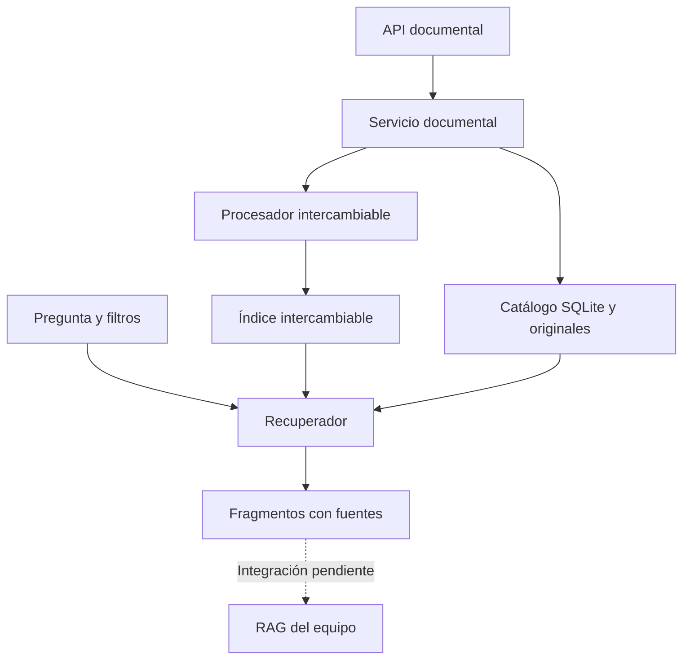
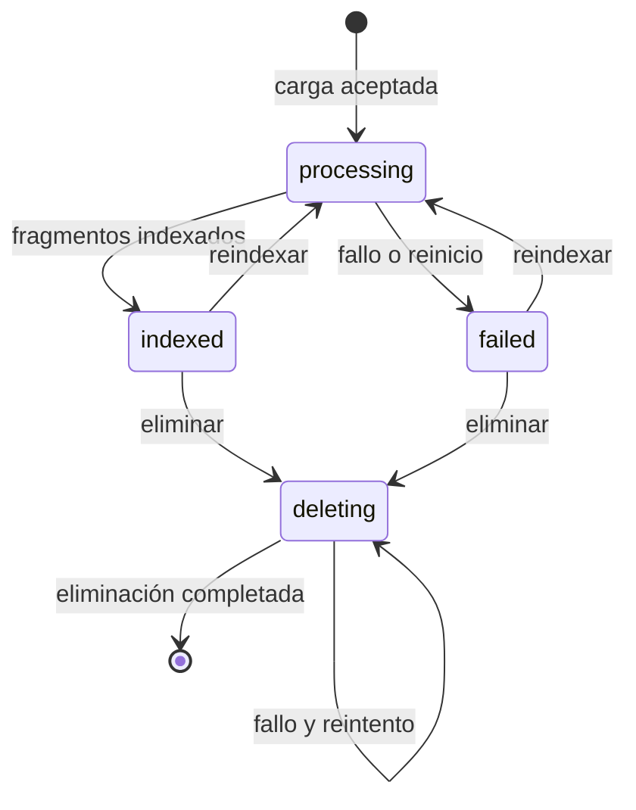

# PRL-IA

Asistente documental de prevención de riesgos laborales para consultar información con fuentes verificables. Proyecto de equipo del bootcamp de IA/ML, Módulo V.

**Estado documentado al incorporar `dev` (commit `4b0dbbe`, 30/09/2026):** se dispone de la ingesta y el chunking de persona 1, el almacenamiento vectorial de persona 2 y la gestión documental y recuperación independiente de persona 5. Su presencia en la misma rama no implica que estén conectados de extremo a extremo. La API de persona 5 continúa usando el procesador y el índice léxico de demostración. El adaptador Chroma preparado por separado aún no forma parte de este estado; la cadena RAG y la interfaz completa quedan pendientes de integración y verificación.

## Problema y uso previsto

Trabajadores y responsables de prevención necesitan localizar información dentro de manuales y protocolos. PRL-IA pretende mostrar respuestas basadas en esos documentos, con trazabilidad para su revisión humana. Es una herramienta informativa: no sustituye al personal de prevención ni a los protocolos del centro.

## Alcance de persona 5

Se utiliza el reparto de la captura «Recuperación avanzada y gestión documental», que sustituye el reparto del PDF del plan. Se mantiene su organización de carpetas.

| Archivo | Responsabilidad |
|---|---|
| `src/retrieval.py` | Contratos de fragmentos e índice, filtros, ranking, umbral, deduplicación y fuentes |
| `src/document_service.py` | Carga, catálogo SQLite, estados, reindexación y eliminación; adaptadores demo |
| `src/api_documents.py` | Router reutilizable y API independiente |
| `tests/test_retrieval.py` | Recuperación y contrato del índice |
| `tests/test_documents_api.py` | Ciclo documental, errores, persistencia y recuperación tras fallos |
| `docs/evaluation.md` | Evaluación reproducible y plan de evaluación del RAG |
| `docs/ethical_use.md` | Privacidad, trazabilidad y límites de uso |
| `README.md` | Funcionamiento y puesta en marcha |

La documentación de apoyo se encuentra en `docs/integration.md`, `docs/guia_maria.md` y `docs/github_wsl.md`. Se conserva el corpus sintético y el script de evaluación de P5. Las dependencias se han unificado en `requirements.txt`; los archivos `requirements-persona5.txt` y `requirements-persona5-lock.txt` se han retirado. Las referencias antiguas a ellos en guías auxiliares deben interpretarse según la instalación de este README.

## Aportaciones del equipo incorporadas desde dev

| Área | Archivos principales | Estado y alcance |
|---|---|---|
| Corpus e ingesta — persona 1 | `data/sources.json`, `scripts/download_corpus.py`, `src/ingestion.py` | Manifiesto de nueve fuentes del BOE/INSST; descarga de PDF; extracción y limpieza por página de PDF, TXT y Markdown |
| Chunking — persona 1 | `src/chunking.py`, `scripts/evaluate_chunking.py`, `docs/chunking.md` | Fragmentación por página, metadatos y comparación experimental de tamaños y solapamientos |
| Embeddings e índice — persona 2 | `src/vector_store.py`, `docs/vector_store.md` | Embeddings locales, colección persistente Chroma y búsqueda semántica básica |
| Servicio y recuperación — persona 5 | `src/document_service.py`, `src/retrieval.py`, `src/api_documents.py` | Carga, catálogo, reindexación, eliminación y recuperación con filtros; API independiente con componentes demo |

### Corpus, ingesta y chunking

El manifiesto `data/sources.json` declara nueve documentos del BOE y del INSST,
con título, organismo, tipo, estatus documental y enlaces de origen. Los PDF se
descargan en `data/raw/` y no se incluyen en Git. El script comprueba la firma
PDF de las nuevas descargas y omite los archivos existentes salvo `--force`.

`load_document()` procesa PDF, TXT y Markdown; `load_corpus()` añade los
metadatos del manifiesto. La limpieza normaliza espacios y caracteres invisibles
y une palabras partidas por guiones de fin de línea, conservando listas,
numeraciones y títulos. Las páginas PDF se numeran desde 1; TXT y Markdown
utilizan página 1. No hay OCR.

`split_documents()` usa por defecto **1000 caracteres y 200 de solapamiento**,
con preferencia por cortes en párrafos, frases y espacios. Los fragmentos no
mezclan páginas. Añade posiciones, identificadores e índices de fragmento y,
cuando puede inferirse, una sección. Estos valores no sustituyen todavía los
180/30 **palabras** del procesador demo de la API P5.

El benchmark registrado por persona 1 en
`data/evaluation/chunking_results.json` compara las siguientes configuraciones
con BM25, sobre nueve fuentes, 750 páginas con texto y diez preguntas:

| Tamaño / solapamiento (caracteres) | Fragmentos | Hit@5 | MRR | Precisión@5 | Evidencia@5 |
|---|---:|---:|---:|---:|---:|
| 500 / 50 | 7540 | 90 % | 0,7333 | 30 % | 50,67 % |
| 800 / 120 | 4956 | 90 % | 0,7000 | 30 % | 70,00 % |
| 1000 / 200 | 4170 | 90 % | 0,6833 | 34 % | 80,00 % |

Son resultados aportados por el equipo, no una nueva ejecución al actualizar
este README. La elección 1000/200 prioriza cobertura de evidencia y menor número
de fragmentos, a cambio de mayor duplicación por overlap y menor MRR. BM25 es
una referencia léxica: esos resultados no demuestran la calidad de MiniLM ni
del RAG. Método y límites: [estrategia de chunking](docs/chunking.md).

### Embeddings y almacenamiento vectorial

La implementación de persona 2 utiliza `all-MiniLM-L6-v2` mediante Sentence
Transformers y `chromadb.PersistentClient`. Mantiene la colección
`prl_documentos` en `./chroma_db` y solicita distancia coseno al crearla.
El modelo se inicializa al importar el módulo y puede descargarse la primera
vez; el cálculo de embeddings se realiza localmente.

Su interfaz pública incluye `get_client()`, `get_collection()`,
`add_fragments(fragments)` y `search(query, k=4)`. La búsqueda devuelve texto,
metadatos y **distancia**: una distancia menor representa mayor cercanía.
No es el `score` de relevancia creciente del recuperador P5.

Las pruebas de persona 2 utilizan mocks: verifican las llamadas y la
transformación de datos, sin ejecutar Chroma real ni descargar el modelo.
Detalles: [almacenamiento vectorial](docs/vector_store.md).

### Conexiones aún pendientes

- **P1 → P2:** el chunking entrega `metadata.chunk_id`, mientras que
  `add_fragments()` requiere `id` en el nivel superior. Hace falta adaptar ese
  contrato antes de indexar; no basta con pasar la lista directamente.
- **P1 → P5:** adaptar la ingesta y el chunking al contrato `DocumentProcessor`,
  conservando la identidad del documento, la categoría y las fuentes.
- **P2 → P5:** adaptar el índice al contrato `DocumentIndex`, incluyendo filtros
  antes del ranking, conversión de distancia, sustitución y borrado. La función
  `search()` de P2 por sí sola no cubre estas operaciones.
- **RAG e interfaz:** conectar el contexto con la generación y la presentación,
  comprobar las citas y evaluar cuándo debe abstenerse el sistema.

La API P5 admite actualmente PDF con texto y TXT UTF-8. Que P1 soporte Markdown
no amplía automáticamente los formatos admitidos por esa API.

## Arquitectura de la API documental de demostración



- El **procesador** transforma un documento en fragmentos. El demo permite probar PDF con texto y TXT.
- El **índice** guarda y busca fragmentos. El demo usa coincidencias de palabras, no embeddings.
- El **recuperador** selecciona el contexto por relevancia, filtros y estado documental.
- El **servicio** coordina los pasos y registra qué documentos pueden consultarse.
- La **API** expone esas funciones al frontend y al equipo.

SQLite sustituye un catálogo JSON plano para disponer de restricciones de unicidad y transacciones locales. No sustituye ChromaDB: el catálogo y la base vectorial tienen propósitos distintos. Los originales se guardan con UUID, nunca con una ruta recibida del cliente.

## Estructura

```text
PRL-IA/
  src/
    ingestion.py             # persona 1: lectura y limpieza
    chunking.py              # persona 1: fragmentación y metadatos
    vector_store.py          # persona 2: embeddings y Chroma
    retrieval.py             # persona 5: recuperación y contratos
    document_service.py      # persona 5: servicio y adaptadores demo
    api_documents.py         # persona 5: API independiente
    rag_chain.py             # integración RAG pendiente de verificar
    api.py                   # integración API general pendiente
  frontend/                  # estructura del frontend del equipo
  data/
    sources.json
    raw/                     # PDF locales excluidos; README versionado
    chroma/                  # directorio previsto en la estructura inicial
    evaluation/
      chunking_questions.json
      chunking_results.json
    examples/prevencion_demo.txt
    persona5/                # datos locales de la demo P5; excluidos de Git
  chroma_db/                 # persistencia local usada por P2; excluida de Git
  scripts/
    download_corpus.py
    evaluate_chunking.py
    evaluate_retrieval.py
  tests/
    test_ingestion.py
    test_chunking.py
    test_evaluate_chunking.py
    test_vector_store.py
    test_retrieval.py
    test_documents_api.py
    fixtures_retrieval.json
  docs/
    chunking.md
    vector_store.md
    evaluation.md
    ethical_use.md
    integration.md
    guia_maria.md
    github_wsl.md
  requirements.txt           # dependencias comunes
  .env.example
  .gitignore
  README.md
```

## Instalar y ejecutar en Ubuntu/WSL

Comprobado con Python 3.12. Las instrucciones se ejecutan en Ubuntu, no en PowerShell. Los comandos parten de una copia del repositorio con las aportaciones del equipo incorporadas. Si el entorno ya existe y las dependencias están instaladas, basta con activarlo; no hace falta recrearlo ni reinstalarlo por actualizar la documentación.

```bash
cd "/mnt/c/Users/EVO/Desktop/BOOTCAMP/MODULO V/Proyecto PRL-IA/PRL-IA"
python3 --version
# Solo en la primera instalación, si todavía no existe venv:
python3 -m venv venv
# Activar el entorno virtual
source venv/bin/activate

# Instalar PyTorch para CPU, sin dependencias CUDA
python -m pip install "torch==2.14.0+cpu" --index-url https://download.pytorch.org/whl/cpu

# Instalar las dependencias comunes del proyecto
python -m pip install -r requirements.txt

# Comprobar las dependencias
python -m pip check
python -m pytest tests/test_retrieval.py tests/test_documents_api.py -q
python -m uvicorn src.api_documents:create_app --factory --host 127.0.0.1 --port 8005
```

Abre <http://127.0.0.1:8005/docs>. El puerto 8005 permite probar este módulo sin ocupar el 8000 de la API general. Para detenerlo, pulsa `Ctrl+C`. Ejecuta un único proceso/worker: el bloqueo del servicio es local al proceso.

Si `venv` no está disponible en Ubuntu, instala el paquete correspondiente a tu Python (`sudo apt install python3-venv` en la distribución habitual) y repite su creación. No instales las dependencias de este proyecto en el Python global.

No hacen falta `.env`, claves ni modelos descargados para la demo. Configuración opcional:

```bash
export PRL_P5_DATA_DIR="data/persona5"
```

No se carga `.env` automáticamente. Si cambias la ruta, exclúyela también de Git. Las dependencias comunes están en `requirements.txt`. La demo léxica no inicializa `src/vector_store.py`; disponer de Chroma instalado no cambia por sí solo el índice que utiliza la API.

## Descargar el corpus y reproducir el benchmark de P1

Estos pasos son independientes de la carga de documentos mediante la API P5.
Requieren conexión para descargar los PDF y espacio local para conservarlos.
Desde la raíz del repositorio, con el entorno activado:

```bash
python scripts/download_corpus.py
python scripts/evaluate_chunking.py
```

Ejecuta la evaluación después de comprobar que las descargas necesarias han
terminado correctamente. El benchmark valida las páginas y evidencias de las
preguntas y actualiza `data/evaluation/chunking_results.json`. Los PDF remotos
pueden cambiar; los resultados registrados corresponden al corpus utilizado
por el equipo en su ejecución. Descargar los documentos no los indexa
automáticamente en Chroma ni en el catálogo de la API P5.

## Demo de principio a fin — persona 5

Con el servidor arrancado, abre otra terminal en la raíz del proyecto:

```bash
curl -s http://127.0.0.1:8005/health
curl -s -X POST http://127.0.0.1:8005/api/v1/documents \
  -F "file=@data/examples/prevencion_demo.txt" -F "category=demo"
curl -s -X POST http://127.0.0.1:8005/api/v1/retrieval/query \
  -H "Content-Type: application/json" \
  -d '{"query":"trabajos en altura","k":3,"min_score":0.25,"filters":{"category":"demo"}}'
curl -s -X POST http://127.0.0.1:8005/api/v1/retrieval/query \
  -H "Content-Type: application/json" -d '{"query":"salarios vacaciones"}'
```

La primera carga devuelve `201`, un `document_id`, estado `indexed` y número de fragmentos. La consulta devuelve `sources` con texto, documento, página cuando exista y puntuación. La última devuelve `has_context: false` y `reason: no_relevant_context`. **No se genera ninguna respuesta con un LLM.** La persona 3 debe convertir la falta de contexto en una abstención explícita.

Repetir la misma carga devuelve `409`: el contenido ya está registrado aunque cambie el nombre. Consulta el listado para recuperar su ID. Puedes probar reindexación y eliminación desde `/docs`.

## Endpoints

| Método | Ruta | Uso |
|---|---|---|
| GET | `/health` | Identifica procesador e índice activos |
| POST | `/api/v1/documents` | Archivo multipart `file` y campo `category` opcional |
| GET | `/api/v1/documents` | Catálogo documental |
| GET | `/api/v1/documents/{document_id}` | Estado y metadatos |
| POST | `/api/v1/documents/{document_id}/reindex` | Reprocesa el original sin duplicar fragmentos |
| DELETE | `/api/v1/documents/{document_id}` | Elimina original, fragmentos y registro; devuelve 204 |
| POST | `/api/v1/retrieval/query` | Consulta, `k`, umbral y filtros |

Filtros exactos combinados con AND: `document_id`, `source`, `page`, `section`, `category`. No constituyen permisos de acceso. `page` es un entero positivo; el resto son textos. `section` está disponible en el contrato, pero el procesador demo no extrae secciones y devuelve `null`.

Parámetros: `1 <= k <= 20`; consulta de 1 a 2000 caracteres; `0 <= min_score <= 1`. Nunca se devuelven coincidencias de score cero. La demo calcula score como proporción de palabras significativas de la pregunta presentes en el fragmento; no es una probabilidad de corrección.

Errores: 400 nombre inválido, 404 documento inexistente, 409 duplicado/conflicto, 413 tamaño, 415 extensión, 422 validación/procesamiento, 503 indisponibilidad. Un procesamiento fallido después del registro devuelve un objeto documental con ID y estado `failed`; errores previos al registro devuelven `detail`. Un fallo de proveedor durante procesamiento también queda como `failed`/422; revisar y reintentar. Las demás indisponibilidades se traducen a 503.

## Estados y persistencia



Solo los documentos `indexed` participan en recuperación. Si falla una reindexación, los fragmentos anteriores pueden continuar físicamente en el índice, pero quedan ocultos hasta una reindexación correcta o eliminación. Si falla eliminar, se mantiene `deleting` y se puede reintentar. El SHA-256 identifica duplicados y detecta cambios manuales en originales; no anonimiza su contenido.

## Pruebas y evaluación

Para comprobar conjuntamente las pruebas incorporadas de P1, P2 y P5:

```bash
python -m pytest tests/test_ingestion.py tests/test_chunking.py tests/test_evaluate_chunking.py tests/test_vector_store.py tests/test_retrieval.py tests/test_documents_api.py -q
```

Este README no atribuye un resultado a esa ejecución conjunta: hay que registrar
su salida tras resolver el merge. Las pruebas vectoriales de P2 usan mocks;
no equivalen a una prueba semántica real ni a una integración completa.

Para repetir solo la evaluación de la demo P5:


```bash
python -m pytest tests/test_retrieval.py tests/test_documents_api.py -q
python -m scripts.evaluate_retrieval
```

Verificación del 29/09/2026: **49 pruebas aprobadas**, con un aviso de deprecación del cliente HTTP de pruebas, detallado en [evaluación](docs/evaluation.md). El corpus sintético obtiene Recall@3 = 0,833 en 6 consultas con fuente y contexto vacío correcto en 2/2 consultas sin fuente. Estos datos son pruebas del baseline, no una validación de seguridad o exactitud del RAG.

## Checklist del briefing

| Requisito | Evidencia de esta entrega | Estado |
|---|---|---|
| Recuperar k fragmentos con metadatos | `Retriever`, API y tests | Verificado con índice léxico demo |
| Filtros y relevancia | Metadatos, umbral, orden y deduplicación | Implementado y probado |
| Carga y gestión documental | Catálogo, originales, reindexación y eliminación | Implementado y probado |
| Chunking justificado | P1: 1000/200 caracteres, benchmark BM25 y `docs/chunking.md` | Implementado y evaluado por P1; conexión a la API P5 pendiente |
| Embeddings y base vectorial persistente | P2: MiniLM, Chroma y `docs/vector_store.md` | Implementado en P2; conexión a P5 y evaluación semántica pendientes |
| Orquestación LangChain/LlamaIndex | Contrato de contexto | Pendiente de P3 |
| Respuestas fundamentadas y abstención | Se informa si hay contexto | Evaluación del LLM pendiente |
| Interfaz y fuentes visibles | API entrega fuentes | Integración visual pendiente |
| Trabajo colaborativo | Aportaciones de P1, P2 y P5 reunidas en la rama de trabajo | Cierre del merge, pruebas conjuntas y revisión pendientes |
| Ética y privacidad | `docs/ethical_use.md` | Riesgos documentados; controles productivos pendientes |

## Límites y siguiente integración

Prototipo local, sin autenticación, autorización por documento, OCR ni análisis antimalware. PDF: máximo 300 páginas y 10 MiB; TXT UTF-8. No debe exponerse públicamente ni usarse con información sensible. El límite de tamaño se comprueba tras el parser multipart; para despliegue se necesita un límite de petición previo, aislamiento del parser y control de recursos. La demo recorre todos los fragmentos. La implementación vectorial de P2 ya está disponible, pero no está conectada a esta API en el estado documentado.

La selección revisa hasta `5*k` candidatos (máximo 100), por lo que duplicados o documentos ocultos pueden dar menos de k resultados aun existiendo otros válidos. El equipo puede ampliar el contrato con paginación de candidatos antes de usar corpus grandes. Reindexar o eliminar registros fallidos evita acumularlos.

Integración: [contratos](docs/integration.md). Para comprender y defender tu parte: [guía de María](docs/guia_maria.md). Las implementaciones de P1 y P2 incorporadas desde `dev` conservan la autoría del equipo. La próxima fase es conectar sus contratos con P5 y comprobar el flujo completo antes de incorporar generación con LLM.
