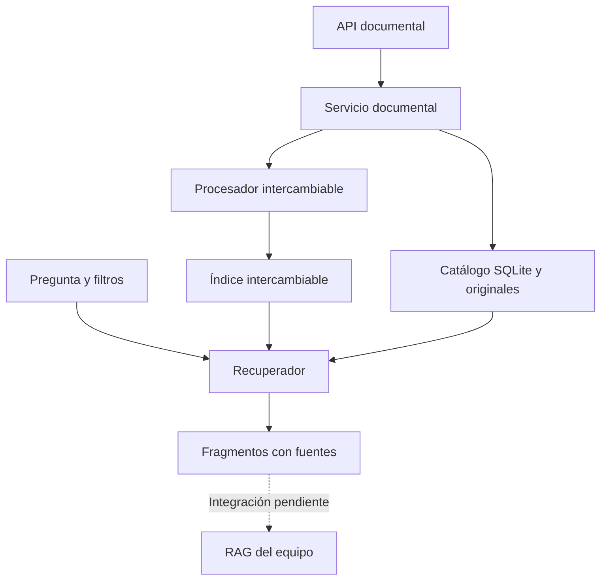
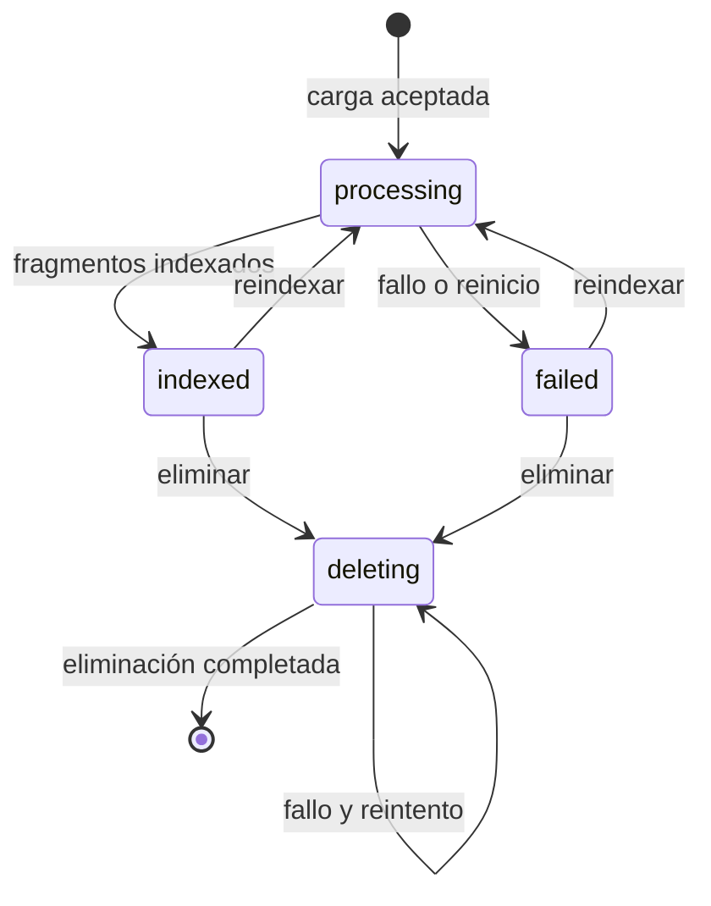

# PRL-IA

Asistente documental de prevención de riesgos laborales para consultar información con fuentes verificables. Proyecto de equipo del bootcamp de IA/ML, Módulo V.

**Estado de esta entrega: módulo de persona 5 operativo de forma independiente.** Incluye gestión documental y recuperación con un índice léxico de demostración. La ingesta definitiva, los embeddings/ChromaDB, el RAG y la interfaz se integrarán con los módulos del equipo. Este repositorio no se presenta todavía como un RAG completo.

## Problema y uso previsto

Trabajadores y responsables de prevención necesitan localizar información dentro de manuales y protocolos. PRL-IA pretende mostrar respuestas basadas en esos documentos, con trazabilidad para su revisión humana. Es una herramienta informativa: no sustituye al personal de prevención ni a los protocolos del centro.

## Alcance de persona 5

Se utiliza el reparto de la captura «Recuperación avanzada y gestión documental», que sustituye el reparto del PDF del plan. Se mantiene su organización de carpetas.

| Archivo | Responsabilidad |
|---|---|
| `src/retrieval.py` | Contratos de fragmentos e índice, filtros, ranking, umbral, deduplicación y fuentes |
| `src/document_service.py` | Carga, catálogo SQLite, estados, reindexación y eliminación; adaptadores demo |
| `src/api_documents.py` | Router reutilizable y API independiente |
| `tests/test_retrieval.py` | Recuperación y contrato del índice |
| `tests/test_documents_api.py` | Ciclo documental, errores, persistencia y recuperación tras fallos |
| `docs/evaluation.md` | Evaluación reproducible y plan de evaluación del RAG |
| `docs/ethical_use.md` | Privacidad, trazabilidad y límites de uso |
| `README.md` | Funcionamiento y puesta en marcha |

Se añaden `docs/integration.md`, `docs/guia_maria.md`, `docs/github_wsl.md`, `requirements-persona5.txt`, el bloqueo de versiones, un corpus sintético y un script de evaluación para facilitar la integración y la defensa.

## Arquitectura



- El **procesador** transforma un documento en fragmentos. El demo permite probar PDF con texto y TXT.
- El **índice** guarda y busca fragmentos. El demo usa coincidencias de palabras, no embeddings.
- El **recuperador** selecciona el contexto por relevancia, filtros y estado documental.
- El **servicio** coordina los pasos y registra qué documentos pueden consultarse.
- La **API** expone esas funciones al frontend y al equipo.

SQLite sustituye un catálogo JSON plano para disponer de restricciones de unicidad y transacciones locales. No sustituye ChromaDB: el catálogo y la base vectorial tienen propósitos distintos. Los originales se guardan con UUID, nunca con una ruta recibida del cliente.

## Estructura

```text
PRL-IA/
  src/
    ingestion.py             # módulo del equipo, sin implementar en la base revisada
    chunking.py              # módulo del equipo
    vector_store.py          # módulo del equipo
    rag_chain.py             # módulo del equipo
    api.py                   # API general del equipo
    retrieval.py             # persona 5
    document_service.py      # persona 5
    api_documents.py         # persona 5
  frontend/                  # estructura existente del equipo; no modificada
  data/
    raw/                     # reservado por el equipo
    chroma/                  # reservado por el equipo
    examples/prevencion_demo.txt
    persona5/                # creado al ejecutar; excluido de Git
      raw/
      documents.sqlite3
  tests/
    test_retrieval.py
    test_documents_api.py
    fixtures_retrieval.json
  scripts/evaluate_retrieval.py
  docs/
    evaluation.md
    ethical_use.md
    integration.md
    guia_maria.md
    github_wsl.md
  requirements.txt            # del equipo; no modificado por esta entrega
  requirements-persona5.txt
  requirements-persona5-lock.txt
  .env.example               # del equipo; no modificado
  .gitignore
  README.md
```

## Instalar y ejecutar en Ubuntu/WSL

Comprobado con Python 3.12. Las instrucciones se ejecutan en Ubuntu, no en PowerShell. Primero coloca los cambios con [la guía de GitHub y WSL](docs/github_wsl.md).

```bash
cd "/mnt/c/Users/EVO/Desktop/BOOTCAMP/MODULO V/Proyecto PRL-IA/PRL-IA"
python3 --version
python3 -m venv .venv
source .venv/bin/activate
# Activar el entorno virtual
source venv/bin/activate

# Instalar PyTorch para CPU, sin dependencias CUDA
python -m pip install "torch==2.14.0+cpu" --index-url https://download.pytorch.org/whl/cpu

# Instalar las dependencias comunes del proyecto
python -m pip install -r requirements.txt

# Comprobar las dependencias
python -m pip check
python -m pip install -r requirements-persona5-lock.txt
python -m pytest tests/test_retrieval.py tests/test_documents_api.py -q
python -m uvicorn src.api_documents:create_app --factory --host 127.0.0.1 --port 8005
```

Abre <http://127.0.0.1:8005/docs>. El puerto 8005 permite probar este módulo sin ocupar el 8000 de la API general. Para detenerlo, pulsa `Ctrl+C`. Ejecuta un único proceso/worker: el bloqueo del servicio es local al proceso.

Si `venv` no está disponible en Ubuntu, instala el paquete correspondiente a tu Python (`sudo apt install python3-venv` en la distribución habitual) y repite su creación. No instales las dependencias de este proyecto en el Python global.

No hacen falta `.env`, claves ni modelos descargados para la demo. Configuración opcional:

```bash
export PRL_P5_DATA_DIR="data/persona5"
```

No se carga `.env` automáticamente. Si cambias la ruta, exclúyela también de Git. Para integrar dependencias, el equipo deberá reconciliar las versiones con su entorno; no se ha sustituido el `requirements.txt` compartido.

## Demo de principio a fin

Con el servidor arrancado, abre otra terminal en la raíz del proyecto:

```bash
curl -s http://127.0.0.1:8005/health
curl -s -X POST http://127.0.0.1:8005/api/v1/documents \
  -F "file=@data/examples/prevencion_demo.txt" -F "category=demo"
curl -s -X POST http://127.0.0.1:8005/api/v1/retrieval/query \
  -H "Content-Type: application/json" \
  -d '{"query":"trabajos en altura","k":3,"min_score":0.25,"filters":{"category":"demo"}}'
curl -s -X POST http://127.0.0.1:8005/api/v1/retrieval/query \
  -H "Content-Type: application/json" -d '{"query":"salarios vacaciones"}'
```

La primera carga devuelve `201`, un `document_id`, estado `indexed` y número de fragmentos. La consulta devuelve `sources` con texto, documento, página cuando exista y puntuación. La última devuelve `has_context: false` y `reason: no_relevant_context`. **No se genera ninguna respuesta con un LLM.** La persona 3 debe convertir la falta de contexto en una abstención explícita.

Repetir la misma carga devuelve `409`: el contenido ya está registrado aunque cambie el nombre. Consulta el listado para recuperar su ID. Puedes probar reindexación y eliminación desde `/docs`.

## Endpoints

| Método | Ruta | Uso |
|---|---|---|
| GET | `/health` | Identifica procesador e índice activos |
| POST | `/api/v1/documents` | Archivo multipart `file` y campo `category` opcional |
| GET | `/api/v1/documents` | Catálogo documental |
| GET | `/api/v1/documents/{document_id}` | Estado y metadatos |
| POST | `/api/v1/documents/{document_id}/reindex` | Reprocesa el original sin duplicar fragmentos |
| DELETE | `/api/v1/documents/{document_id}` | Elimina original, fragmentos y registro; devuelve 204 |
| POST | `/api/v1/retrieval/query` | Consulta, `k`, umbral y filtros |

Filtros exactos combinados con AND: `document_id`, `source`, `page`, `section`, `category`. No constituyen permisos de acceso. `page` es un entero positivo; el resto son textos. `section` está disponible en el contrato, pero el procesador demo no extrae secciones y devuelve `null`.

Parámetros: `1 <= k <= 20`; consulta de 1 a 2000 caracteres; `0 <= min_score <= 1`. Nunca se devuelven coincidencias de score cero. La demo calcula score como proporción de palabras significativas de la pregunta presentes en el fragmento; no es una probabilidad de corrección.

Errores: 400 nombre inválido, 404 documento inexistente, 409 duplicado/conflicto, 413 tamaño, 415 extensión, 422 validación/procesamiento, 503 indisponibilidad. Un procesamiento fallido después del registro devuelve un objeto documental con ID y estado `failed`; errores previos al registro devuelven `detail`. Un fallo de proveedor durante procesamiento también queda como `failed`/422; revisar y reintentar. Las demás indisponibilidades se traducen a 503.

## Estados y persistencia



Solo los documentos `indexed` participan en recuperación. Si falla una reindexación, los fragmentos anteriores pueden continuar físicamente en el índice, pero quedan ocultos hasta una reindexación correcta o eliminación. Si falla eliminar, se mantiene `deleting` y se puede reintentar. El SHA-256 identifica duplicados y detecta cambios manuales en originales; no anonimiza su contenido.

## Pruebas y evaluación

```bash
python -m pytest tests/test_retrieval.py tests/test_documents_api.py -q
python -m scripts.evaluate_retrieval
```

Verificación del 29/09/2026: **49 pruebas aprobadas**, con un aviso de deprecación del cliente HTTP de pruebas, detallado en [evaluación](docs/evaluation.md). El corpus sintético obtiene Recall@3 = 0,833 en 6 consultas con fuente y contexto vacío correcto en 2/2 consultas sin fuente. Estos datos son pruebas del baseline, no una validación de seguridad o exactitud del RAG.

## Checklist del briefing

| Requisito | Evidencia de esta entrega | Estado |
|---|---|---|
| Recuperar k fragmentos con metadatos | `Retriever`, API y tests | Verificado con índice léxico demo |
| Filtros y relevancia | Metadatos, umbral, orden y deduplicación | Implementado y probado |
| Carga y gestión documental | Catálogo, originales, reindexación y eliminación | Implementado y probado |
| Chunking justificado | Baseline 180 palabras/30 de overlap, por página | Demo; P1 definirá estrategia final |
| Embeddings y base vectorial persistente | Contrato de índice | Pendiente de P2; SQLite demo no satisface este requisito |
| Orquestación LangChain/LlamaIndex | Contrato de contexto | Pendiente de P3 |
| Respuestas fundamentadas y abstención | Se informa si hay contexto | Evaluación del LLM pendiente |
| Interfaz y fuentes visibles | API entrega fuentes | Integración visual pendiente |
| Trabajo colaborativo | Entrega aislada, guía de rama y PR | Push y revisión pendientes de María/equipo |
| Ética y privacidad | `docs/ethical_use.md` | Riesgos documentados; controles productivos pendientes |

## Límites y siguiente integración

Prototipo local, sin autenticación, autorización por documento, OCR ni análisis antimalware. PDF: máximo 300 páginas y 10 MiB; TXT UTF-8. No debe exponerse públicamente ni usarse con información sensible. El límite de tamaño se comprueba tras el parser multipart; para despliegue se necesita un límite de petición previo, aislamiento del parser y control de recursos. Los índices grandes requieren una implementación vectorial; la demo recorre todos los fragmentos.

La selección revisa hasta `5*k` candidatos (máximo 100), por lo que duplicados o documentos ocultos pueden dar menos de k resultados aun existiendo otros válidos. El equipo puede ampliar el contrato con paginación de candidatos antes de usar corpus grandes. Reindexar o eliminar registros fallidos evita acumularlos.

Integración: [contratos](docs/integration.md). Para comprender y defender tu parte: [guía de María](docs/guia_maria.md). No se han implementado ni modificado los módulos asignados al resto del equipo.
